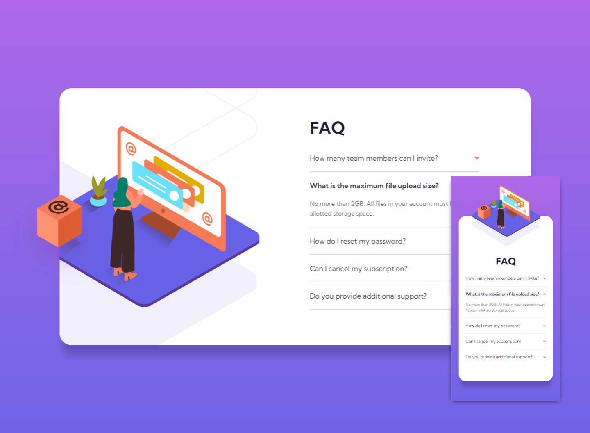
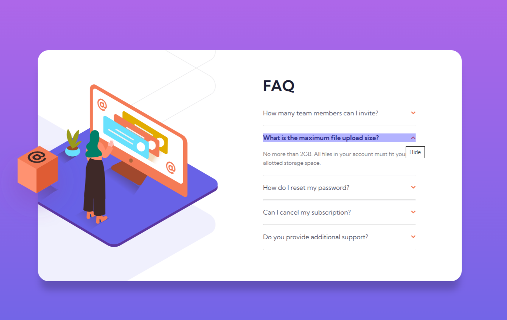

# Frontend Mentor - FAQ accordion card solution

This is a solution to the [FAQ accordion card challenge on Frontend Mentor](https://www.frontendmentor.io/challenges/faq-accordion-card-XlyjD0Oam). Frontend Mentor challenges help you improve your coding skills by building realistic projects.

## Table of contents

- [Overview](#overview)
  - [The challenge](#the-challenge)
  - [Screenshot](#screenshot)
  - [Links](#links)
- [My process](#my-process)
  - [Built with](#built-with)
  - [What I learned](#what-i-learned)
  - [Continued development](#continued-development)
- [Author](#author)

**Note: Delete this note and update the table of contents based on what sections you keep.**

## Overview

### The challenge

Users should be able to:

- View the optimal layout for the component depending on their device's screen size
- See hover states for all interactive elements on the page
- Hide/Show the answer to a question when the question is clicked

### Screenshot



### Links

- Live Site URL: [https://cholis04.github.io/faq-accordion-card-main/](https://cholis04.github.io/faq-accordion-card-main/)

## My process

### Built with

- Mobile-first workflow
- Flexbox
- CSS Grid
- HTML Radio Button

I decided not to use javascript in this challenge. So I need to use :checked state on css. Yes, checkboxes allow for that, but to create an accordion element, only one element is open the others will be closed.

This is why I use radio buttons instead of checkboxes. because the radio button can be used to select only one option.

However, other problems persist. On the checkbox we can uncheck / deselect the options, this allowing the accordion to be open or closed.But on radio buttons. once we select , we can not deselect alias Uncheck. This causes the accordion element to continue to open.

Without using javascript, this would be a bit tricky. I added an option to another hidden radio button. some kind of hook maybe. So on each accordion box I put a label that points to one radio input type.



Yes, maybe you all have an even better way to make writing code much simpler. Feel free to let me know that.

### What I learned

Creating accordion elements using radio buttons

```html
<div class="faq">
  <h1>FAQ</h1>
  <input
    type="radio"
    id="close-faq"
    name="question"
    value="Close All Faq"
    class="rbd-close"
  />
  <div class="question-box">
    <input
      type="radio"
      id="faq-1"
      name="question"
      value="Open Faq 1"
      class="radio-button"
    />
    <label for="faq-1">
      <h2>How many team members can I invite?</h2>
      <div class="icon-arrow">
        
      </div>
      <label for="close-faq" class="toggle-overlay" title="Hide"></label>
    </label>
    <p>
      You can invite up to 2 additional users on the Free plan. There is no
      limit on team members for the Premium plan.
    </p>
  </div>
  <hr />
  <div class="question-box">
    <input
      type="radio"
      id="faq-2"
      name="question"
      value="Open Faq 2"
      class="radio-button"
      checked="true"
    />
    <label for="faq-2">
      <h2>What is the maximum file upload size?</h2>
      <div class="icon-arrow">
        
      </div>
      <label for="close-faq" class="toggle-overlay" title="Hide"></label>
    </label>
    <p>
      No more than 2GB. All files in your account must fit your allotted storage
      space.
    </p>
  </div>
  <hr />
</div>
```

Add position on background image in css,

```css
.box-faq {
  background-position: -580px -296px;
  /* background-position: center top; */
}
```

### Continued development

So far, the radio button can't be unchecked. However it can be done if using checkbox , but all accordion elements don't close automatically. It is very complicated. It may be necessary to have Javascript to manipulate accordion elements. What do you think?

## Author

- Website - [https://cholis04.github.io](https://cholis04.github.io)
- Frontend Mentor - [@cholis04](https://www.frontendmentor.io/profile/cholis04)
- Dribbble - [cholis04](https://dribbble.com/cholis04)
- Instagram - [@cholis04](https://instagram.com/cholis04)
- Codepen - [cholis04](https://codepen.io/cholis04)
